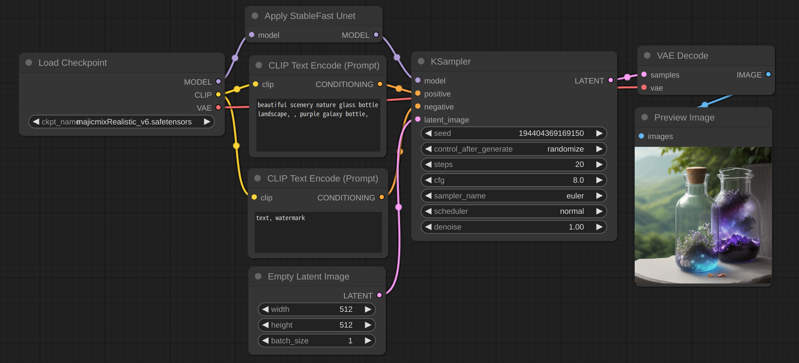
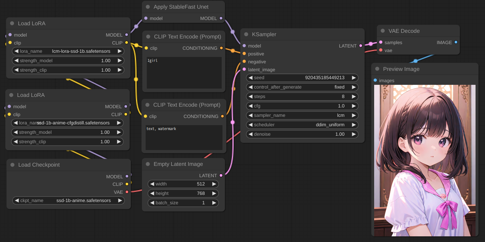

# ComfyUI_stable_fast

Experimental usage of [stable-fast](https://github.com/chengzeyi/stable-fast).

# Installation

```
git clone https://github.com/gameltb/ComfyUI_stable_fast custom_nodes/ComfyUI_stable_fast
```

[stable-fast installation](https://github.com/chengzeyi/stable-fast?tab=readme-ov-file#installation)

## Usage

It can work with Lora, ControlNet and lcm. SD1.5, SDXL, and SSD-1B are supported.  
Run ComfyUI with `--disable-cuda-malloc` may be possible to optimize the speed further.

> [!NOTE]
> - FreeU and PatchModelAddDownscale are now supported experimentally, Just use the comfy node normally.
> - Although this repo was created for stable_fast, I found it to work well with TensorRT, so I added an experimental new node at branch `tensorrt`. You can try it as you want.

> [!NOTE]
> 
> - If you are using WSL, please do not install Triton for the time being due to bugs. 
> - stable fast not work well with accelerate, So this node has no effect when the vram is low. For example: 6G vram card run SDXL.  




> [!NOTE]
>
> - stable fast will optimize the speed when generating images using the same model for the second time. if you switch models or Lora frequently, please consider disable enable_cuda_graph.
> - stable fast should be directly connected to ksampler, and it is better not to have other nodes between them.

# TensorRT
## Installation
```
pip install onnx zstandard
pip install --pre --upgrade --extra-index-url https://pypi.nvidia.com tensorrt
pip install onnx-graphsurgeon polygraphy --extra-index-url https://pypi.ngc.nvidia.com
```
## Usage

Run ComfyUI with `--disable-xformers` and use `Apply TensorRT Unet` like `Apply StableFast Unet`.  
The Engine will be cached in `tensorrt_engine_cache`, Each is about 2MB.
